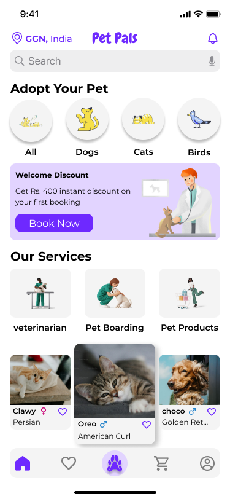

# 🐶 Pet Care & Adoption App

A mobile-first UI/UX case study focused on making pet care and adoption simple, safe, and community-driven.

## 📌 Overview
The Pet Care & Adoption app is designed to help users discover adoptable pets, access expert pet care advice, and connect with nearby pet owners or shelters.

## 🎯 Objective
To reduce the friction in the pet adoption process and promote responsible pet care through a user-friendly mobile experience.

## 🧩 Key Features
- Browse and filter adoptable pets based on location, type, and age
- Book virtual visits and adoption appointments
- In-app pet care journal and reminders
- Emergency vet locator and resources
- Community Q&A and pet parenting tips

## 🎨 Design Process
1. **User Research** – Interviews with pet owners & adopters
2. **Persona Development** – Two key personas defined
3. **User Journey Mapping** – From pet discovery to adoption
4. **Wireframing & Prototyping** – Low-fidelity → high-fidelity
5. **Usability Testing** – Iterative improvements based on feedback

## 🖼️ Preview

  

## 🔗 Full Case Study on Behance
[👉 View Case Study on Behance](https://www.behance.net/your-petcare-case-link](https://www.behance.net/gallery/204987723/UX-Case-Study-Pet-Care-App-%28PetPals%29)

---
